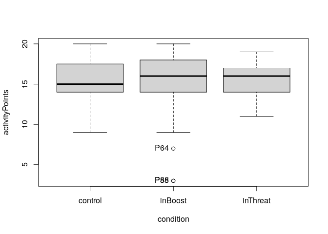
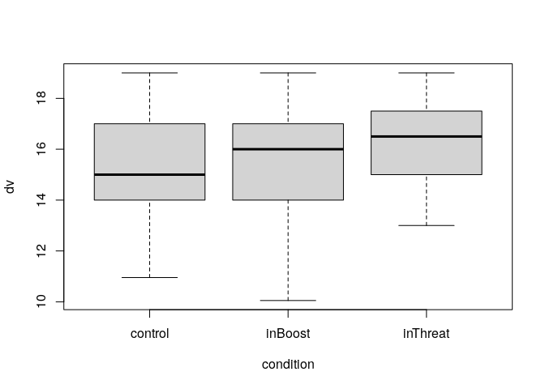
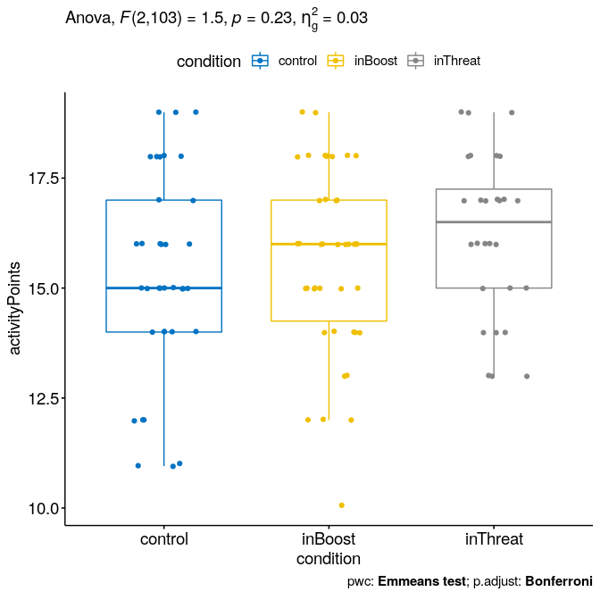

ANOVA test for `activityPoints`\~`condition`
================
Geiser C. Challco <geiser@alumni.usp.br>

-   [Initial Variables and Data](#initial-variables-and-data)
    -   [Descriptive statistics of initial
        data](#descriptive-statistics-of-initial-data)
-   [Checking of Assumptions](#checking-of-assumptions)
    -   [Assumption: Symmetry and treatment of
        outliers](#assumption-symmetry-and-treatment-of-outliers)
    -   [Assumption: Normality distribution of
        data](#assumption-normality-distribution-of-data)
    -   [Assumption: Homogeneity of data
        distribution](#assumption-homogeneity-of-data-distribution)
-   [Saving the Data with Normal Distribution Used for Performing ANOVA
    test](#saving-the-data-with-normal-distribution-used-for-performing-anova-test)
-   [Computation of ANOVA test and Pairwise
    Comparison](#computation-of-anova-test-and-pairwise-comparison)
    -   [ANOVA test](#anova-test)
    -   [Pairwise comparison](#pairwise-comparison)
    -   [Descriptive Statistic of Estimated Marginal
        Means](#descriptive-statistic-of-estimated-marginal-means)
    -   [Anova plots for the dependent variable
        “activityPoints”](#anova-plots-for-the-dependent-variable-activitypoints)
    -   [Textual Report](#textual-report)
-   [Tips and References](#tips-and-references)

## Initial Variables and Data

-   R-script file: [../code/anova.R](../code/anova.R)
-   Initial table file:
    [../data/initial-table.csv](../data/initial-table.csv)
-   Data for activityPoints
    [../data/table-for-activityPoints.csv](../data/table-for-activityPoints.csv)
-   Table without outliers and normal distribution of data:
    [../data/table-with-normal-distribution.csv](../data/table-with-normal-distribution.csv)
-   Other data files: [../data/](../data/)
-   Files related to the presented results: [../results/](../results/)

### Descriptive statistics of initial data

| condition | variable       |   n |   mean | median | min | max |    sd |    se |    ci |  iqr | symmetry | skewness | kurtosis |
|:----------|:---------------|----:|-------:|-------:|----:|----:|------:|------:|------:|-----:|:---------|---------:|---------:|
| control   | activityPoints |  40 | 15.225 |     15 |   9 |  20 | 2.713 | 0.429 | 0.868 | 3.25 | YES      |   -0.345 |   -0.604 |
| inBoost   | activityPoints |  50 | 15.120 |     16 |   3 |  20 | 3.712 | 0.525 | 1.055 | 4.00 | NO       |   -1.556 |    2.612 |
| inThreat  | activityPoints |  32 | 15.719 |     16 |  11 |  19 | 2.188 | 0.387 | 0.789 | 3.00 | YES      |   -0.313 |   -1.008 |
| NA        | activityPoints | 122 | 15.311 |     16 |   3 |  20 | 3.040 | 0.275 | 0.545 | 3.75 | NO       |   -1.354 |    3.068 |

<!-- -->

    ## [1] "P55" "P64" "P88"

## Checking of Assumptions

### Assumption: Symmetry and treatment of outliers

#### Applying transformation for skewness data when normality is not achieved

#### Dealing with outliers (performing treatment of outliers)

``` r
rdat[["activityPoints"]] <- winzorize(rdat[["activityPoints"]],"activityPoints", c("condition"))
```

### Assumption: Normality distribution of data

#### Removing data that affect normality (extreme values)

``` r
non.normal <- list(
"activityPoints" = c("P04","P79","P108","P121","P51","P64","P71","P74","P80","P88","P92","P93","P82","P85","P111","P112")
)
sdat <- removeFromDataTable(rdat, non.normal, wid)
```

#### Result of normality test in the residual model

|                | var            |   n | skewness | kurtosis | symmetry | statistic | method     |     p | p.signif | normality |
|:---------------|:---------------|----:|---------:|---------:|:---------|----------:|:-----------|------:|:---------|:----------|
| activityPoints | activityPoints | 106 |   -0.358 |    -0.43 | YES      |     3.009 | D’Agostino | 0.222 | ns       | QQ        |

#### Result of normality test in each group

This is an optional validation and only valid for groups with number
greater than 30 observations

| condition | variable       |   n |   mean | median |    min | max |    sd |    se |    ci |  iqr | normality | method       | statistic |     p | p.signif |
|:----------|:---------------|----:|-------:|-------:|-------:|----:|------:|------:|------:|-----:|:----------|:-------------|----------:|------:|:---------|
| control   | activityPoints |  36 | 15.303 |   15.0 | 10.953 |  19 | 2.296 | 0.383 | 0.777 | 3.00 | YES       | Shapiro-Wilk |     0.940 | 0.051 | ns       |
| inBoost   | activityPoints |  42 | 15.644 |   16.0 | 10.050 |  19 | 2.078 | 0.321 | 0.648 | 2.75 | YES       | Shapiro-Wilk |     0.949 | 0.060 | ns       |
| inThreat  | activityPoints |  28 | 16.214 |   16.5 | 13.000 |  19 | 1.833 | 0.346 | 0.711 | 2.25 | YES       | Shapiro-Wilk |     0.935 | 0.084 | ns       |

**Observation**:

As sample sizes increase, parametric tests remain valid even with the
violation of normality \[[1](#references)\]. According to the central
limit theorem, the sampling distribution tends to be normal if the
sample is large, more than (`n > 30`) observations. Therefore, we
performed parametric tests with large samples as described as follows:

-   In cases with the sample size greater than 100 (`n > 100`), we
    adopted a significance level of `p < 0.01`

-   For samples with `n > 50` observation, we adopted D’Agostino-Pearson
    test that offers better accuracy for larger samples
    \[[2](#references)\].

-   For samples’ size between `n > 100` and `n <= 200`, we ignored the
    normality test, and our decision of validating normality was based
    only in the interpretation of QQ-plots and histograms because the
    Shapiro-Wilk and D’Agostino-Pearson tests tend to be too sensitive
    with values greater than 200 observation \[[3](#references)\].

-   For samples with `n > 200` observation, we ignore the normality
    assumption based on the central theorem limit.

### Assumption: Homogeneity of data distribution

|                | var            | method        | formula                       |   n | df1 | df2 | statistic |     p | p.signif |
|:---------------|:---------------|:--------------|:------------------------------|----:|----:|----:|----------:|------:|:---------|
| activityPoints | activityPoints | Levene’s test | `activityPoints`\~`condition` | 106 |   2 | 103 |       0.3 | 0.742 | ns       |

## Saving the Data with Normal Distribution Used for Performing ANOVA test

``` r
ndat <- sdat[[1]]
for (dv in names(sdat)[-1]) ndat <- merge(ndat, sdat[[dv]])
write.csv(ndat, paste0("../data/table-with-normal-distribution.csv"))
```

Descriptive statistics of data with normal distribution

|                  | condition | variable       |   n |   mean | median |    min | max |    sd |    se |    ci |  iqr |
|:-----------------|:----------|:---------------|----:|-------:|-------:|-------:|----:|------:|------:|------:|-----:|
| activityPoints.1 | control   | activityPoints |  36 | 15.303 |   15.0 | 10.953 |  19 | 2.296 | 0.383 | 0.777 | 3.00 |
| activityPoints.2 | inBoost   | activityPoints |  42 | 15.644 |   16.0 | 10.050 |  19 | 2.078 | 0.321 | 0.648 | 2.75 |
| activityPoints.3 | inThreat  | activityPoints |  28 | 16.214 |   16.5 | 13.000 |  19 | 1.833 | 0.346 | 0.711 | 2.25 |

<!-- -->

## Computation of ANOVA test and Pairwise Comparison

### ANOVA test

| var            | Effect    | DFn | DFd |    SSn |     SSd |     F |     p |   ges | p.signif |
|:---------------|:----------|----:|----:|-------:|--------:|------:|------:|------:|:---------|
| activityPoints | condition |   2 | 103 | 13.166 | 452.257 | 1.499 | 0.228 | 0.028 | ns       |

### Pairwise comparison

| var            | group1  | group2   | estimate | conf.low | conf.high |    se | statistic |     p | p.adj | p.adj.signif |
|:---------------|:--------|:---------|---------:|---------:|----------:|------:|----------:|------:|------:|:-------------|
| activityPoints | control | inBoost  |   -0.341 |   -1.285 |     0.603 | 0.476 |    -0.717 | 0.475 | 1.000 | ns           |
| activityPoints | control | inThreat |   -0.911 |   -1.959 |     0.136 | 0.528 |    -1.726 | 0.087 | 0.262 | ns           |
| activityPoints | inBoost | inThreat |   -0.570 |   -1.584 |     0.444 | 0.511 |    -1.115 | 0.267 | 0.802 | ns           |

### Descriptive Statistic of Estimated Marginal Means

| var            | condition |   n | emmean |   mean | conf.low | conf.high |    sd | sd.emms | se.emms |
|:---------------|:----------|----:|-------:|-------:|---------:|----------:|------:|--------:|--------:|
| activityPoints | control   |  36 | 15.303 | 15.303 |   14.610 |    15.996 | 2.296 |   2.095 |   0.349 |
| activityPoints | inBoost   |  42 | 15.644 | 15.644 |   15.003 |    16.285 | 2.078 |   2.095 |   0.323 |
| activityPoints | inThreat  |  28 | 16.214 | 16.214 |   15.429 |    17.000 | 1.833 |   2.095 |   0.396 |

### Anova plots for the dependent variable “activityPoints”

``` r
plots <- oneWayAnovaPlots(sdat[["activityPoints"]], "activityPoints", between, aov[["activityPoints"]], pwc[["activityPoints"]], c("jitter"), font.label.size=14, step.increase=0.25)
```

#### Plot of “activityPoints” based on “condition”

``` r
plots[["condition"]]
```

<!-- -->

### Textual Report

ANOVA tests with independent between-subjects variables “condition”
(control, inBoost, inThreat) were performed to determine statistically
significant difference on the dependent varibles “activityPoints”. For
the dependent variable “activityPoints”, there was not statistically
significant effects.

## Tips and References

-   Use the site <https://www.tablesgenerator.com> to convert the HTML
    tables into Latex format

-   \[2\]: Miot, H. A. (2017). Assessing normality of data in clinical
    and experimental trials. J Vasc Bras, 16(2), 88-91.

-   \[3\]: Bárány, Imre; Vu, Van (2007). “Central limit theorems for
    Gaussian polytopes”. Annals of Probability. Institute of
    Mathematical Statistics. 35 (4): 1593–1621.